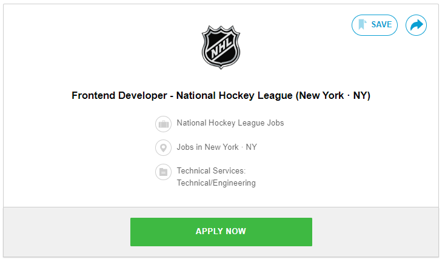

<html>
<body style="background-color:lightblue;font-family:times new roman">

<body>

<h1 style="color:Maroon;border:2px solid darkBlue;font-family:courier;text-align:center;">TROY KIRK</h1>
<h2 style="color:Maroon;">Personal Information<h2>

<h5>

 
 
 
 

Name:Troy Kirk

Student Number: s3996531

Student Email: s3996531@student.rmit.edu.au

Nationality: Australian, American and British.

Education: Certificate IV in Fitness, Bachelor of Paramedical Science and Certificate III in Business. 

Languages spoken: English, minimal Spanish, soon to be Japanese.

Hobbies: travelling, gaming, running, snowboarding, watching sport. 

Favorite Sports: Ice Hockey, AFL, soccer. Actually, as long as there is a ball I’m interested.

Family: Erica my wife and Blake my 10-year-old son 

Pet: We have a 40kg mutt named Bernie. He is American Staffy/Australian shepherd/boxer/rottweiler/husky.  He has travelled around the world with us and consequently because of immigration related fees might be  the world’s most expensive mutt.

Interesting fact: During the covid outbreak I was lucky enough to live in a ski town and consequently able  to snowboard over 200 days over the 19/2020 and 20/2021 winter seasons.

 
 
 
 
<h2 style="color:Maroon;">Interest in IT<h2>
<h5>

Born in the mid-eighties, I grew up in the southeast suburbs of Melbourne. As a youngster technology was minimal and almost nonexistent. I spent my childhood outside riding bikes, building tree houses and playing football. If the streetlights had not turned on yet, then we were still outside. The closest I got to technology before the age of around 10 was the black and white television in the rumpus room. If we were lucky enough on a Saturday night we were allowed to watch “Hey, Hey Its Saturday” on the big Sony Television in the front room.

I was first introduced to something more advanced in the mid-nineties when Santa Claus brought me a Sega Mega Drive. I loved my Mega Drive and Sonic the Hedgehog so much, however, was only allowed to play it about 1 hour a week. I never was able to finish that game. I later found out the average time to finish the game was 90 minutes. This was the beginning of my interest in the video game industry.

I remember beginning high school in 1999 and my mother marching up the principal’s office complaining that it was unfair the homework now needs to be typed on computer and no longer handwritten. Obviously following multiple conversations, we soon got our first PC which was running on windows 95. The late 90s for me featured dial up interest, Napster, msn messenger and World of Warcraft. What an enjoyable time that was to grow up alongside developing technology. We didn’t have computer class introduced into our school until the early 2000 and then all we had was a basic lab filled with the Apple candy-coloured big box PCs.

It wasn’t until the mid-2000’s and the arrival of Microsoft’s Xbox that I become really interested in the gaming interest spending ours at night achievement seeking and playing online with friends.

Fast forward to 2009. I enrolled in university and moved the Sunshine Coast. Spending 4 years on the coast as a student paramedic. Looking back on it now hindsight suggest I should have completed a bachelor of IT instead. After university I moved to Colorado in the USA. After spending 10 years state side, meeting my now wife, raising our now 9-year-old son we decided to move back to the Sunshine Coast. After spending 18 months back in Australia we have decided to move back to America.

Over the past 10 years I have worked on a computer every day. I have always enjoyed working with IT and have decided with our recent moves backwards and forwards that earning a degree in a career that I can be employed wherever I am in the world is very important. After speaking with Open University, they suggested RMIT as a perfect starting point to launch a career in the IT industry. After growing up in Melbourne I had always heard of the amazing reputation that students and courses of RMIT had associated with them. My knowledge of IT is very basic, and I am an open book ready to learn as much as I can. I am excited to see where this IT journey takes me moving forward. Hopefully one day I can join my passion of sports and IT together to form a successful long career. 

<h2 style="color:Maroon;">Ideal Job</h2>
<h5>

As well as having a high interested in the IT industry I am also a sports fanatic. I love all sports but 3 of my favourites are ice hockey, AFL and soccer. One of my most visit websites is that of the National Hockey League. I spent every day watching highlights, reading stories, checking scores and stats.

After a searching online while browsing the days recent hockey replays I stumbled across this job advertisement:

Please find job advertisement here:<a href="https://www.teamworkonline.com/hockey-jobs/hockeyjobs/nhl-league-office/frontend-developer-2029702"> Frontend Developer</a>

Frontend Developer - National Hockey League

The National Hockey League is the number one ice hockey league competition in the world. The NHL is looking for a frontend developer to help play a key role in designing, coding and creating all the visual elements that fans log on to their website and expect every day. A frontend developer will participate in code reviews, test and troubleshoot bugs on the website and work directly with project managers to continuing developing high end digital experiences.
 

This position interested me as ice hockey is easily my favorite sport and I am visiting their website multiple times a day. If I could combine, I love of the game with my passion to create new excited project it would be an amazing rewarding career change. 

The position requires a bachelor’s degree in Computer Science or Software Engineering. Experience working with JavaScript and in the software development industry is highly desired. The ability to have high communication skills and the ability to work with multiple teams and external partners is a necessary ability. 
At this stage in the early weeks in my IT education I have begun with design this basic profile website and very basic coding programs using the Python program. It seems easy enough to say I am well on my way to gain all the necessary skills and experience I will need for this job in the future. Currently I will continue to refine and learn as much as possible can during my IT degree. Moving forward I will just keep an open mind and take any opportunities and experience that come my way. Additional and maybe most importantly keep following the NHL and the mighty Colorado Avalanche.

<h2 style="color:Maroon;">Personal Profile <h2>
<h5>
<h4 style=text-align:center;>Myers-Briggs test</h4>

<a href="https://www.16personalities.com">www.16personalities.com</a>

After completion of the Myers-Briggs test found at 16personalities my result has been shown as INFJ-A. This is commonly known as the Advocate. Advocates tend to be quite, serving, inspiring and tireless idealists.

The results of my test are as follows

55% INTROVERTED

45% EXTRAVERTED

Introverted individuals tend to prefer fewer, yet deep and meaningful, social interactions and often feel drawn to calmer environments.

52% INTUITIVE

48% OBSERVANT

Intuitive individuals are very imaginative, open-minded, and curious. They value originality and focus on hidden meanings and distant possibilities.

57% FEELING

43% THINKING

Feeling individuals value emotional expression and sensitivity. They place a lot of importance on empathy, social harmony, and cooperation.

65% JUDGING

35% PROSPECTING

Judging individuals are decisive, thorough, and highly organized. They value clarity, predictability, and closure, preferring structure and planning to spontaneity.

85% ASSERTIVE

15% TURBULENT

Assertive individuals are self-assured, even-tempered, and resistant to stress. They refuse to worry too much and tend to be self-confident when striving to achieve goals.

What's Your Learning Style?

<a
href="http://www.educationplanner.org/students/self-assessments/learning-styles-quiz.shtml">Learning Style </a>

The Results

Your Scores:

Auditory: 40%

Visual: 30%

Tactile: 30%

You are an Auditory learner!

Auditory

If you are an auditory learner, you learn by hearing and listening. You understand and remember things you have heard. You store information by the way it sounds, and you have an easier time understanding spoken instructions than written ones. You often learn by reading out loud because you have to hear it or speak it in order to know it.

Big 5 Test

 <a
href="http://www.my-personality-test.com">Big 5 Test</a>

After receiving this these results, I tend to agree with all results apart from one. In the Big 5 test my result was low for openness to experience. One of my favourite things to do is experience new things. The result explained to me that I am a good team member. I can take lead of team if needed and I can sit back and let someone else be the focus of the group. Saying this I always like to help others and make sure I am doing everything I can to complete a goal. I do like to sit back and identify other personality types and how I can adjust my behavior to best mesh with them. When it comes to being part of a team, I am more than happy to play whatever role needs to be done whether that be a leader at the top direct others or a foot soldier at the bottom taking orders and getting the work done.

<h2 style="color:Maroon;">Project Idea</h2>
<h5>

Overview -

Are you a sports fan? Do you love to go to live events? If you’re a sports fans then you love statistics. Have you ever wanted to track the teams and stadiums that you have visited? This app will allow the user to search for teams, events and stadiums and tag themselves in events that they have attend. They can also rate their experience at the event leaving tips, tricks and advice for other sports fans. This app will use GPS and mapping technology as well as a blogging section to provide users with a way to showcase their sporting journeys across the globe.
 

Motivation -

While living in America my wife had a job which included a lot of travel. My son and I are huge NHL ice hockey and MLB baseball fans. Whichever city we visited we would try and visit the cities sporting events. We have a wall map of America that we pin with logos when we have visited a game. As far as I know there is currently no app or web application that deliveries a digital track version of this. This tracking/blog site can be used by fans of all sports. Sports fans love achievements and stats. This app would be able to provide information about fan experience and keep track of teams watched and stadiums visited.

Description -

The basic idea would revolve around the user creating an account. Once an account is created the user would have to select their sport from a list. All sports, leagues and teams would be available and grouped together accordingly. The user would create a very brief profile page highlighting their favourite teams and sports. 
When a user attends a game the user would search for the team, event and or stadium they are visiting and check into the visited event. Marking themselves as attend. This would then create a checklist and highlight their visits on a map. As they travel the can continue to check in their visits. Part of the checking would involve a star rating of their experience and a tips and tricks section that could be left for future and fellow fans. Photos could also be upload of their experience. Potentially a section for a stadium photo and a kickoff/puck drop/tip off photo should be left for fun. Fans can also use the app to check for tips, tricks and advise if they have never visited the stadium before. Lastly a section for user stats can be found for the user highlighting how many teams they have seen; how many times they have seen a particular team and how many stadiums they have visited. Achievements will be created and awarded similar to the Microsoft Xbox system. Users can add friends and follows others to read review and share anyone elses journey.

 

Tools and Technologies - 

I have briefly run an amateur sports club webpage. This page was already created, and I was shown the basics of how to edit and post news. We used Word press for blogging and adding content to the website. I am only a couple of weeks into my IT education and journey therefore have not learnt or experienced to many apps for creating purpose yet. This week I begun to learn some basics on GitHub. GitHub could potentially be used to design the website and app as well.

The other app I have dabbled with is Google map maker. Google map maker could be edited and used for the mapping, tagging and check in section of the website/app.

XCode is also a beginner program that can be used to create apps. The friendly user interface can be used to design, code, test and to debug. 

I think a combination of these three programs or similar ones will be a good place to start with create this sports travel website/app.

 

Skills Required -

There are many skills need to design an app. You need to have planning, management and research skills. A lot of thought will need to be dedicated the program design to make sure it is successful. All so design skills are essential to ensure that the app looks good and is eye catching to draw people to the app and keep them coming back. Six basic steps can be followed to keep you on track when designing the sports tracker app. Lastly skills that I am currently learning regarding coding will be highly desirable.

1.	Choose a Theme for the sports app.

2.	Build the sports app Home Screen.

3.	Build the Navigation Menu of the app.

4.	Add Content to the sports app.

5.	Design the Launch Screen and App Icon.

6.	Test and publish the sports app.

Outcome - 

The outcome of the app is to track, keeps stats, share tips and provide enjoyment to the user. As I progress through my studies, I will learn key aspects of design and coding that I can use towards creating this app. Once the app has been developed and running smoothly a fair amount oof marketing and promoting will need to happen. Social media will be a good way to advertise the app. Once sports fans have begun using the app, they will share the app with friends and word of mouth will spread, new accounts created and profiles linked together and it will slow gain popularity. As my education continued, I am sure I will gain a lot more information and education that will help me in the last couple of sections. At this stage being only threes weeks into my IT education my knowledge is very limited. 

</body>
</html>
